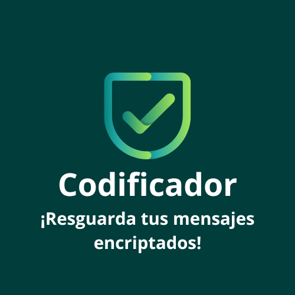

# <h1 align="center"> 🛡️ Codificador: Protege tus Mensajes con Seguridad </h1>



   <p align="center">
   
   </p>

_Tu herramienta de encriptación de confianza para mensajes secretos y seguros._

Codificador es una aplicación diseñada para brindar una capa adicional de seguridad a tus mensajes. En esta primera fase, el programa te permite codificar y decodificar palabras, lo que asegura que tus conversaciones sean privadas y seguras. Con futuras fases planeadas, ¡esta herramienta se convertirá en una poderosa solución de encriptación y seguridad!

### Fases del Proyecto
- **Fase 1**: Codificación básica de palabras, enfocada en seguridad.
- **Fase 2**: Desarrollo de un super codificador basado en ASCII, llamado SAL, para mayor protección.
- **Fase 3**: Creación de un juego de investigación donde los jugadores deberán adivinar códigos de acceso.

## Funcionalidades 🚀

- Encripta textos utilizando una codificación personalizada.
- Desencripta los textos encriptados para volver a su forma original.
- Reglas estrictas en esta primera fase: solo letras minúsculas sin acentos ni caracteres especiales.
- Interfaz intuitiva que permite la inserción del texto y la selección de encriptación o desencriptación.
- Un botón de copia rápida del texto procesado.

### Ejemplos:
```plaintext
"gato" => "gaitober"
"gaitober" => "gato"
```

### 4. **Uso**
   Es un software bastante amigable, sólo debes 
   1. escribir el texto que deseas encriptar en el cuadro de ingreso
   2. presionar el botón de encriptar

   Saldrá como resultado el texto encriptado en el cuadro de resultado, junto con el botón de copiar, el cual, cuando es presionado, coloca el texto encriptado en el cuadro de ingreso.

   Para desencriptar, funciona muy similarmente
   1. escribir el texto que desea desencriptar en el cuadro de ingreso
   2. presionar el botón de desencriptar

```markdown
## ¿Cómo Usarlo? 🛠️
```

1. **Clonar el Repositorio**:
   ```bash
   git clone https://github.com/Hilmar-codificador/codificador.git

2. **Abrir el Proyecto**: 
   ```bash
   Simplemente abre index.html en tu navegador favorito.

3. **Inserta el Texto**: 
   ```bash
   Escribe tu mensaje en el campo de texto, selecciona si deseas encriptar o desencriptar, y haz clic en el botón correspondiente.

4. **Copiar el Resultado**: 
   ```bash
   Usa el botón de copiar para enviar el resultado al portapapeles de tu dispositivo.

### 5. **Soporte**
   Añade una sección de soporte para que los usuarios sepan dónde encontrar ayuda.

```markdown
## Soporte y Ayuda 💬
```

Si encuentras algún problema o tienes preguntas, no dudes en abrir un issue en el repositorio o contactarnos directamente en [Hilmar codificador](mailto:hilmar.brenes@live.com).


## Construido con 🛠️

* HTML
* CSS
* Java Script

## Autores ✒️

* **Hilmar Brenes Ramírez** - *Desarrollador general y visionario del proyecto* - [Hilmar-codificador](https://github.com/Hilmar-codificador)

¡Gracias por ser parte de este proyecto! Siempre estamos abiertos a contribuciones y nuevas ideas.

## Licencia 📄

Este proyecto está bajo la Licencia - mira el archivo [LICENSE.md](LICENSE.md) para más detalles.
